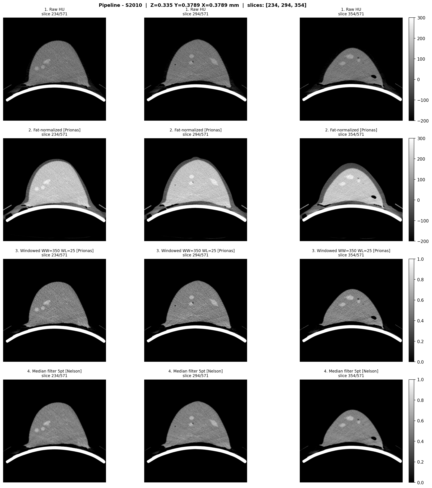
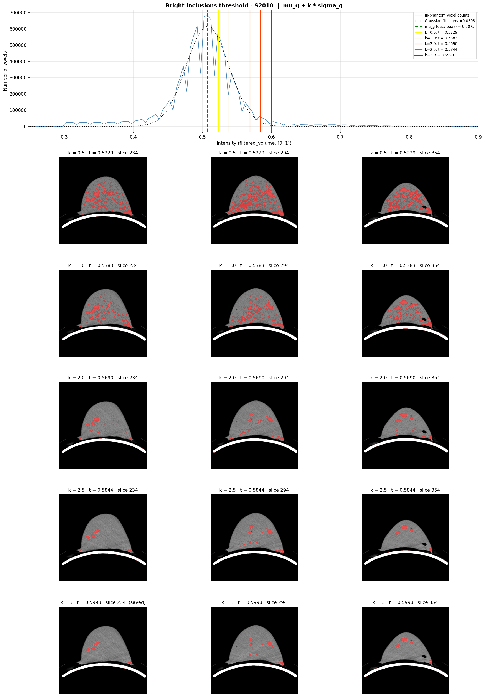
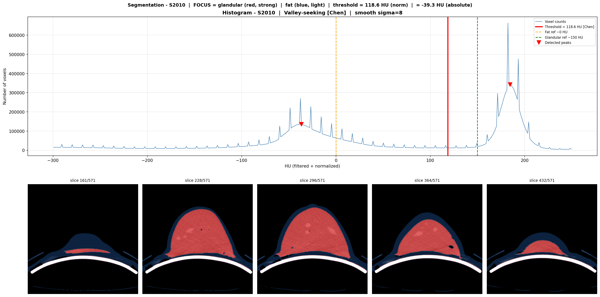

# Preprocessing — Key Results

## Pipeline

```
DICOM CT
  → HU conversion              (pixel × RescaleSlope + RescaleIntercept)
  → fat-based normalisation    (subtract mean HU of fat voxels, HU ∈ [−200, −50])
  → windowing                  (WW=350, WL=25 → [0,1])              [Prionas 2010]
  → 5-point median filter      (slice-by-slice, 2-D per axial slice) [Nelson 2008]
  → Gaussian-fit threshold     (t = μ + 3σ on glandular peak)       [Nelson 2008, Caballo 2018]
  → NRRD output (LPS spatial metadata via SimpleITK)
```

Threshold is data-driven: Gaussian fit on band [0.30, 0.85], left-side only to avoid inclusion-tail bias, k=3.





---

## S2010 — volume geometry

| Parameter | Value |
|---|---|
| Shape (z,y,x) | 571 × 512 × 512 |
| In-plane spacing | 0.378906 mm |
| Slice spacing | 0.335 mm |
| Voxel volume | 0.04809 mm³ |
| Physical extent | ~194 × 194 × 191 mm |
| Origin LPS | (−105.924, 41.474, −216.670) mm |

## S3010 — volume geometry

| Parameter | Value |
|---|---|
| Shape (z,y,x) | 577 × 512 × 512 |
| In-plane spacing | 0.333984 mm |
| Slice spacing | 0.335 mm |
| Physical extent | ~171 × 171 × 193 mm |
| Origin LPS | (−91.485, 52.833, −217.690) mm |

---

## S2010 — inclusion segmentation

| Metric | Value |
|---|---|
| Total inclusion voxels | 364,385 |
| **Total inclusion volume** | **~17.5 cc** (17,525 mm³) |
| Raw components ≥ 30 vox | 761 |
| **True inclusions (shape filter)** | **31** |
| Filtered out (membrane/artefact) | 730 |
| Shape filter criteria | min 150 vox; min bbox side ≥ 2.5 mm; fill ratio ≥ 0.15 |
| Manual 3D Slicer count | **~18** |



### Top 10 inclusions by size (S2010)

| Rank | Voxels | Vol (mm³) | Equiv. diam. (mm) |
|---|---|---|---|
| 1 | 32,390 | 1,558 | 14.4 |
| 2 | 14,446 | 696 | 11.0 |
| 3 | 13,615 | 656 | 10.8 |
| 4 | 13,283 | 640 | 10.7 |
| 5 | 13,005 | 626 | 10.6 |
| 6 | 12,086 | 582 | 10.4 |
| 7 | 11,528 | 555 | 10.2 |
| 8 | 8,295 | 400 | 9.1 |
| 9 | 7,519 | 362 | 8.8 |
| 10 | 5,165 | 249 | 7.8 |

Rank 9 is the first inclusion rendered in raysim: centroid LPS (−16.9, 113.8, −116.2), depth 36.0 mm from probe apex, 7519 voxels, bbox ≈ (10.2, 9.1, 9.0) mm.

---

## S3010 — inclusion segmentation

| Metric | Value |
|---|---|
| Total inclusion voxels | 517,256 |
| Total inclusion volume | ~19.3 cc |
| Components ≥ 500 vox | 136 |

S3010 has not been used in the simulation track (all raysim and MUSiK work uses S2010).

