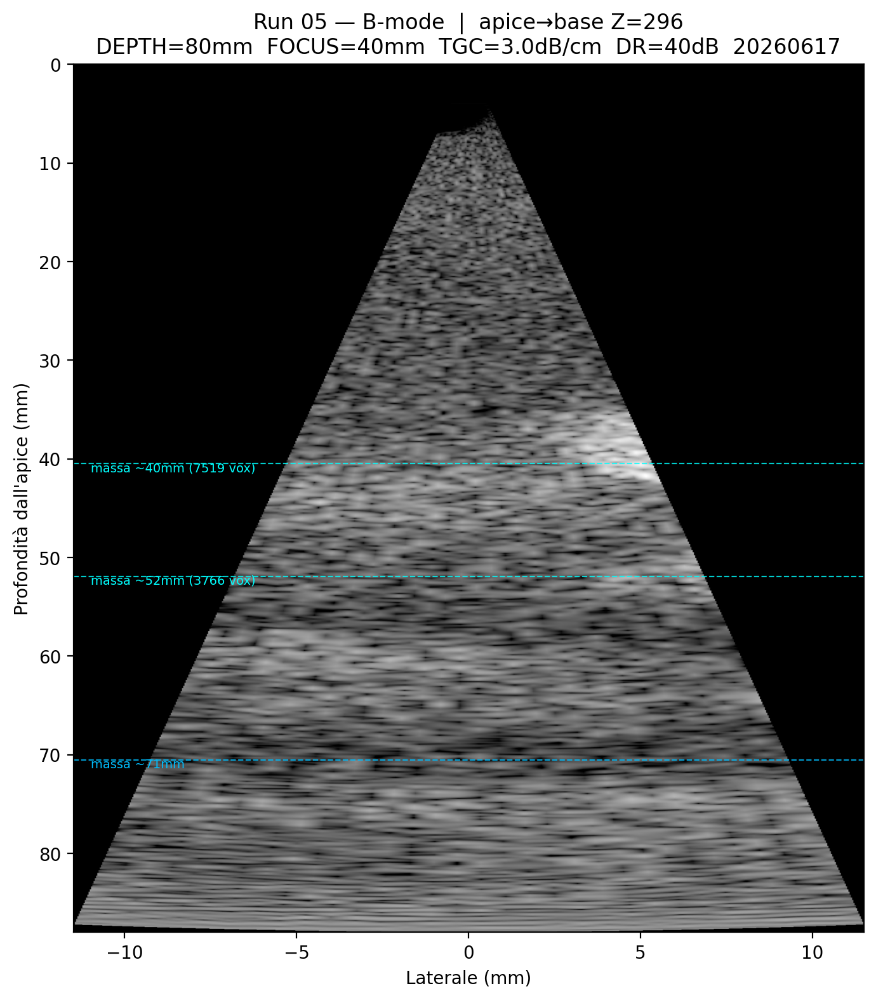
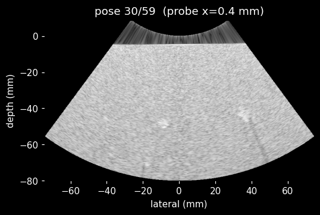
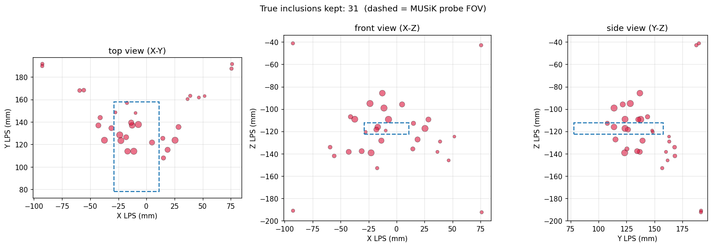
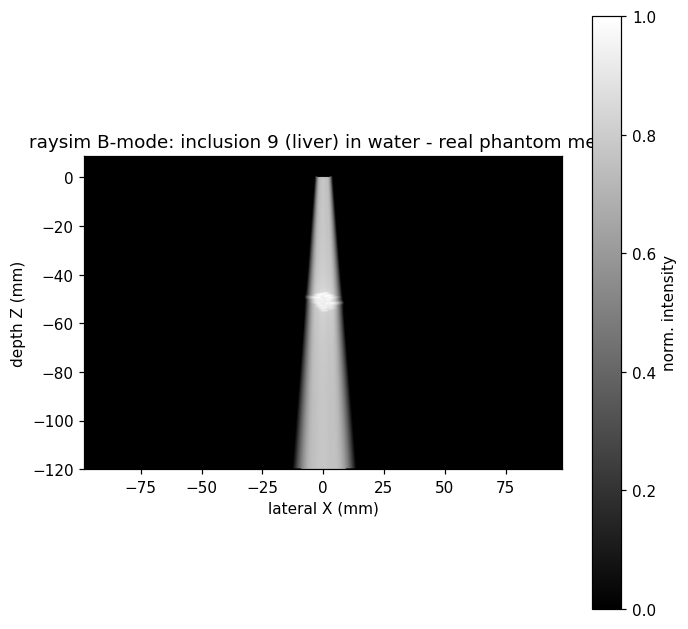
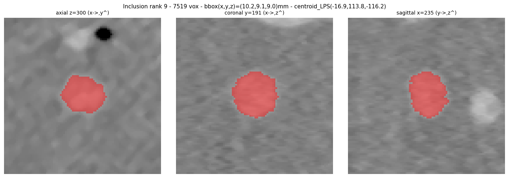

# Simulation — Key Results

## Simulator decision

| Simulator | Family | Real-time | Verdict |
|---|---|---|---|
| MUSiK / k-Wave | wave-based | No (~220 s/frame floor) | Ruled out for the loop |
| NVIDIA Isaac raysim | ray-based | Yes (~3.8 ms/frame) | Adopted — Stage 1 done |

---

## MUSiK / k-Wave timing (CIRS phantom, RTX 2000 Ada)

All times are measured wall-clock from real run logs.

| Run | Config | Wall-clock |
|---|---|---|
| 05 — clinical | 0.25 mm voxel, 32 rays | **462.1 min** |
| 06 — fast calibration | 0.40 mm voxel, 4 rays | **60.9 min** |
| 07 — k-Wave floor | grid_lambda=1.0 (~0.257 mm), 4 rays | **15.6 min / ~220 s** |

**Physical floor:** the acoustic round-trip (80 mm depth at ~1540 m/s) imposes ~2285 timesteps per scan line regardless of hardware. At grid_lambda=1.0 (absolute Nyquist), the floor is ~220 s per acquisition. A 100× faster GPU reaches minutes, never sub-second. **Real-time is structurally impossible with k-Wave.**

MUSiK retained for offline physical validation.

---

## NVIDIA Isaac - Raysim timing — (CIRS phantom, RTX 2000 Ada 8 GB)

Scene: 31 real phantom inclusions at CT positions + tissue background (liver preset).  
Probe swept at 60 poses (lateral slide + gentle tilt); scene built once.

| Metric | Value |
|---|---|
| Scene build (one-time) | ~1037 ms |
| Per-frame min | 3.20 ms |
| Per-frame mean | 4.00 ms |
| Per-frame **median (steady state)** | **3.83 ms** |
| Per-frame max | 6.66 ms (first frame, GPU warm-up) |
| Effective FPS | **~250** |
| VRAM peak | **363 / 8188 MiB** |

---

## Raysim pipeline

1. Connected-component analysis: 761 components ≥30 vox → shape filter → **31 true inclusions** (730 membrane/artefact fragments discarded)
2. Per-inclusion: crop + Gaussian smooth + marching cubes → OBJ (LPS mm, mandatory outward normals)
3. Load 31 meshes into raysim `World`, materials: background=liver, inclusions=fat (chosen by 4-material comparison)
4. Set probe pose to MUSiK apex (LPS → raysim transform verified on rank-9 inclusion)
5. `sim.simulate()` → dB B-mode image (~4 ms) with `-FLT_MAX` sentinel for non-insonified pixels

### Inclusions in the scan plane (Z=296, within ±5 mm)

| Label | Depth (mm) | Lateral (mm) |
|---|---|---|
| 36 | 30.1 | 24.0 |
| **9** | **36.0** | **−7.9** |
| 5 | 45.7 | 34.1 |
| 17 | 48.6 | −9.2 |
| 135 | 70.1 | −0.8 |
| 128 | 70.6 | −18.6 |

Verification: bright spots in the B-mode align with red inclusion markers on the CT axial slice.

